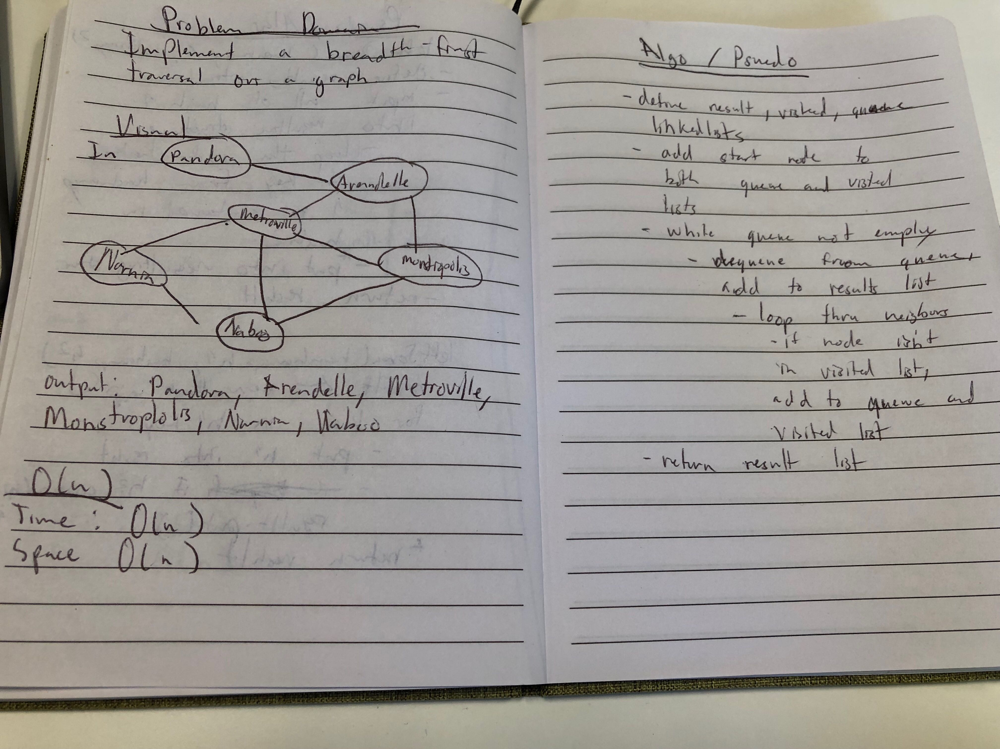

# Graph
This read me contains information about my implementation of graphs.

## Challenge
Implement a Graph

## Approach & Efficiency
Went with a basic implementation of methods.
 * addNodes
 * addEdges
 * getNodes
 * getNeighbors
 * size
  
### Day 2: BreadthFirst
 * breadthFirstTraversal

### Day 4: DepthFirst
* depthFirstTraversal 

## API
  ### Methods:
   * addNodes:
     * Adds a new node to the graph
     * Takes in the value of that node
     * Returns the added node
   * addEdges:
     * Adds a new edge between two nodes in the graph
     * Include the ability to have a “weight”
     * Takes in the two nodes to be connected by the edge
       * Both nodes should already be in the Graph
    * getNodes():
      * Returns all of the nodes in the graph as a collection (set, list, or similar)
    * getNeighbors():
      * Returns a collection of nodes connected to the given node
      * Takes in a given node
      * Include the weight of the connection in the returned collection
    * size:
      * returns size of graph

### Day 2: BreadthFirst
    * breadthFirstTraversal
      * traverses thru the graph and returns a list of all nodes contained

### Day 4: DepthFirst
* depthFirstTraversal
      * traverses thru the graph and returns a list of all nodes contained

[Link to code](../src/main/java/challenges/graph/Graph.java)

[Link to Test](../src/test/java/challenges/GraphTest.java)

## Whiteboard

### Day 2: BreadthFirst

### Day 4: DepthFirst

