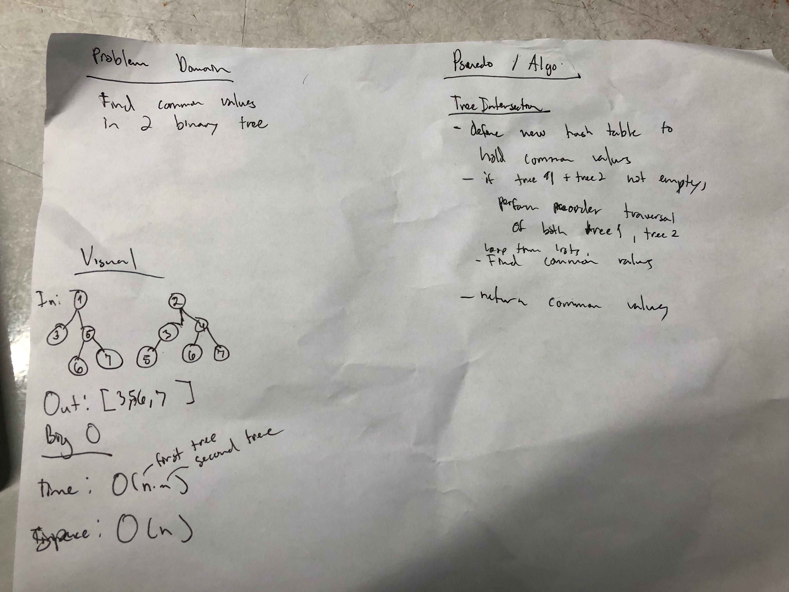

# Left Join
This read me contains information about my left join implementation

## Challenge
Implement a simplified LEFT JOIN for 2 Hashmaps.

## Approach & Efficiency
LeftJoin:
 * leftJoin(Hasmap m1, Hashmap m2): 
     * Time: O(n) Space: O(n)

## API
  ### Methods:
 * leftJoin(Hasmap m1, Hashmap m2):
    * Loop thru hash 1, put everything in hashmap 1 into resulting structure
    * if key in map 1 is contatined in hash 2, add that to resulting structure.

[Link to LeftJoin Code](../src/main/java/challenges/LeftJoin/LeftJoin.java)
[Link to LeftJoin Test](../src/test/java/challenges/LeftJoin/LeftJoinTest.java)

## Whiteboard

