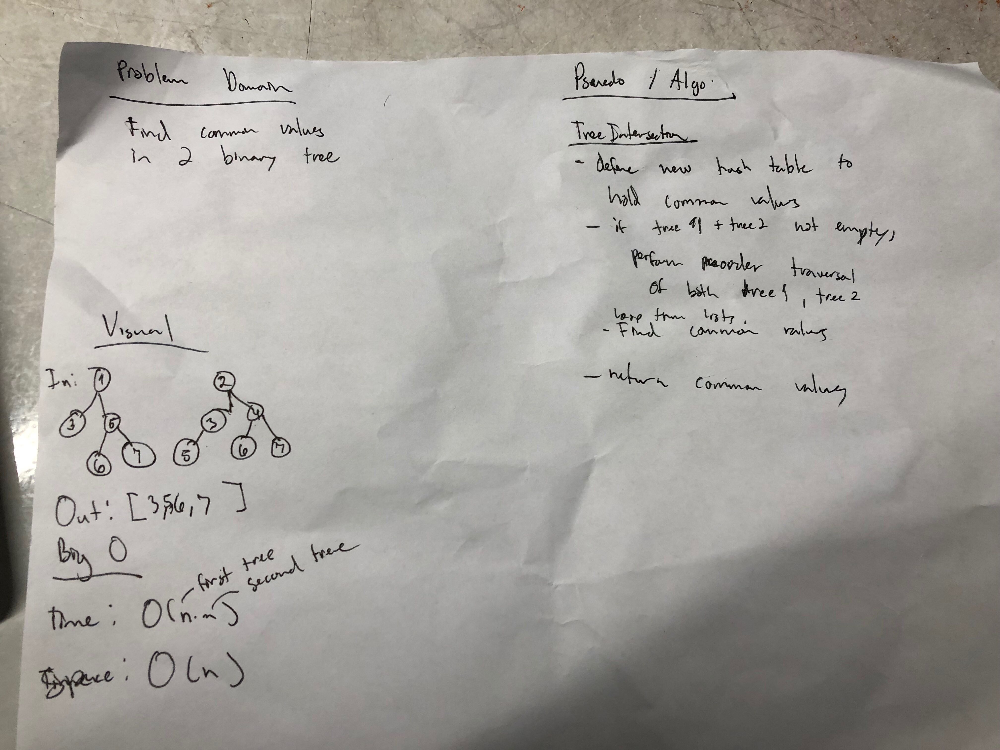

# TreeIntersection
This read me contains information various tree intersection implementation.

## Challenge
Find common values in 2 binary trees

## Approach & Efficiency
TreeIntersection:
 * treeIntersection(BinaryTree t1, BinaryTree t2): 
     * Time: O(n*m) Space: O(n)

## API
  ### Methods:
treeIntersection(BinaryTree t1, BinaryTree t2):
* Preorder traverses two trees, then finds commons in both lists.

[Link to TreeIntersection Code](../src/main/java/challenges/TreeIntersection/TreeIntersection.java)
[Link to TreeIntersection Test](../src/test/java/challenges/TreeIntersection/TreeIntersectionTest.java)

## Whiteboard

