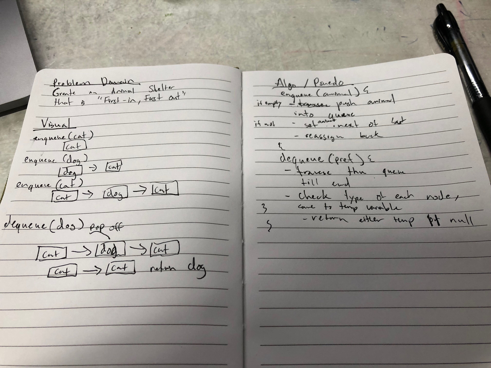

# Stack and Queues
This read me contains information about my Animal shelter implementation.

## Challenge
Implement a "First In, First Out" animal shelter

## Approach & Efficiency
 * Dequeue: 
     * Time: O(n) Space: O(1)
 * Enqueue: 
     * Time: O(1) Space: O(1) 

## API
  ### Methods:
Queue:
* dequeue(String preference): takes in a String preference as an argument, which is the preferred animal the user wants. Will return the animal that has been in the queue the longest and matches the preference.
* enqueue(Animal animal): which takes an Animal as an argument and adds that animal to the queue.

[Link to AnimalShelter Code](../src/main/java/challenges/fifoAnimalShelter/AnimalShelter.java)
       - [Animal.java](../src/main/java/challenges/fifoAnimalShelter/Animal.java)

[Link to AnimalShelterTest Code](../src/test/java/challenges/fifoAnimalShelter/AnimalShelterTest.java)

## Whiteboard

