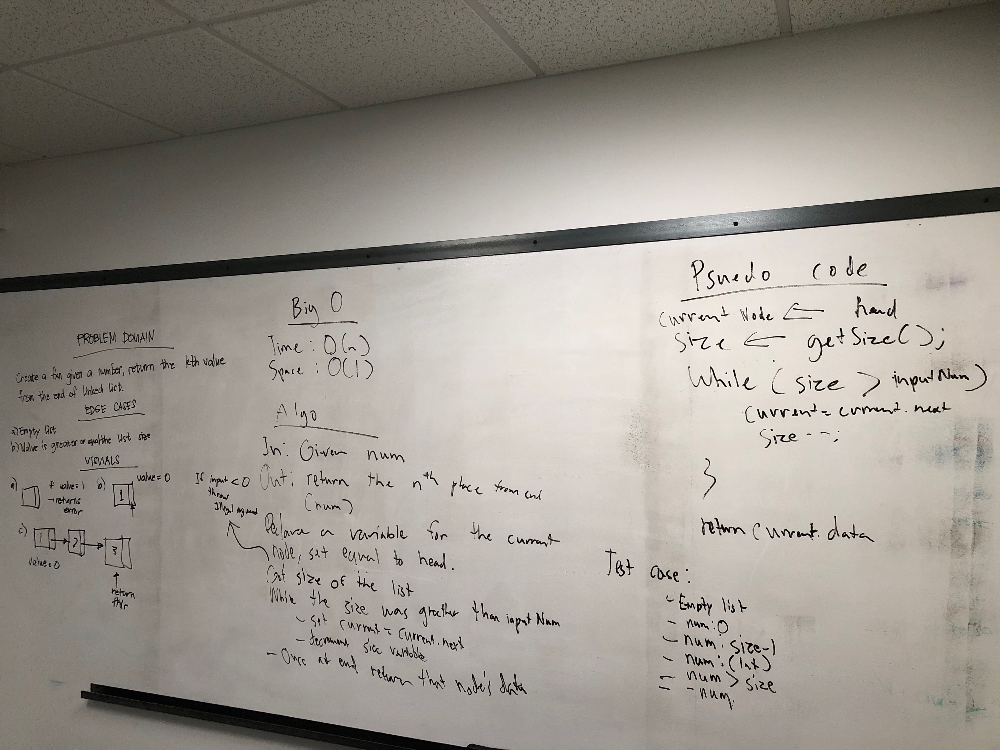

# Singly Linked List
This read me contains information about the linked list coding challenge.

## Challenge
Implement a Singly linked list. And the following methods: insert, includes, print, append, insertBefore, insertAfter

## Approach & Efficiency
Went with a basic implementation.
 * Insert: 
     * Time: O(1) Space: O(1)
 * Includes
     * Time: O(n) Space: O(1)
 * print
     * Time: O(n) Space: O(1)
 * appends
     * Time: O(n) Space: O(1)
 * insertBefore
     * Time: O(n) Space: O(1)
 * insertAfter
     * Time: O(n) Space: O(1)
 * kthFromEnd
     * Time: O(n) Space: O(1)

## API
  ### Methods:
    * insert(int num): creates a new Node with the value passed in, and adds to list by reassigning head
    * includes(int num): traverses thru list and checks if passed in value is contained in a Node within the list
    * print(): traverse thru list and places each node into an arraylist. Returns that arraylist.
    * appends(int data): traverses thru list and adds a Node to the end of list.
    * insertBefore(int positionValue, int newVal): Creates a new Node and adds it before a specified node
    * insertAfter(int positionValue, int newVal): Creates a new Node and adds it after a specified node
    * kthFromEnd: Given a value, traverse thru list and find the nth node from the end of the list

[Link to code](../src/main/java/challenges/linkedlist/LinkedList.java)

[Link to Test](../src/test/java/challenges/LinkedListTest.java)

### Whiteboard implementation
##### Code Challenge 06

##### Code Challenge 07

