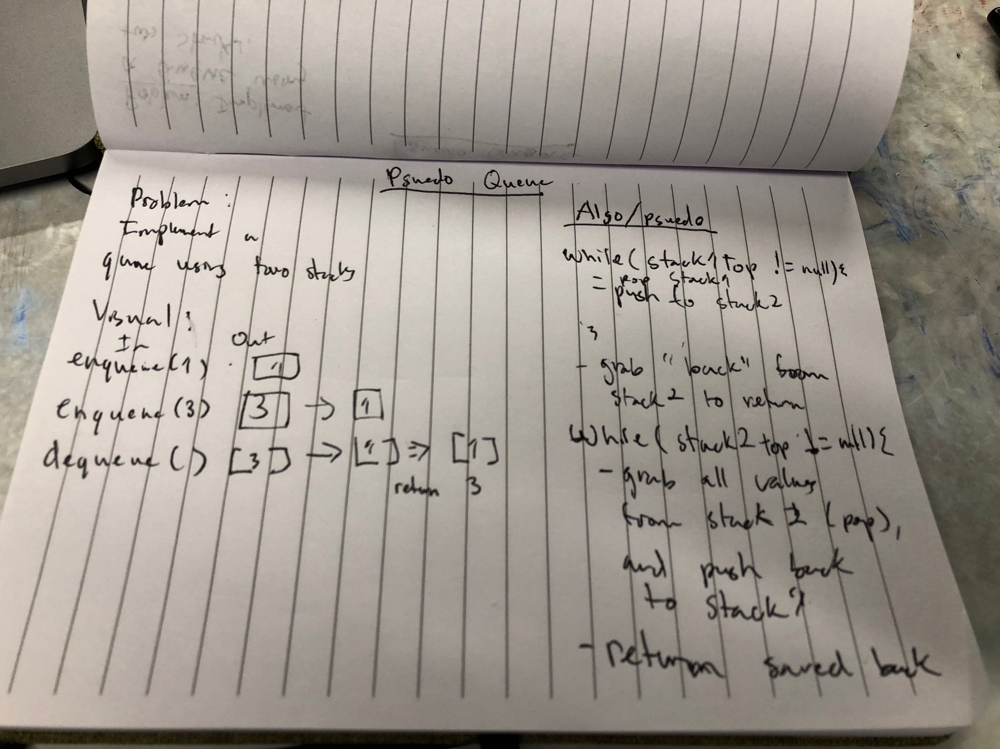

# Stack and Queues
This read me contains information about my psuedo-queue implementation.

## Challenge
Implement a queue using two Stacks.

## Approach & Efficiency
 * Dequeue: 
     * Time: O(n) Space: O(1)
 * Enqueue: 
     * Time: O(1) Space: O(1) 

## API
  ### Methods:
Queue:
* dequeue(): does not take any argument, removes the node from the front of the queue, and returns the node’s value.
* enqueue(int num): which takes any value as an argument and adds a new node with that value to the back of the queue

[Link to Psuedo-Queue Code](../src/main/java/challenges/QueueWithStacks/PsuedoQueue.java)
[Link to Psuedo-Queue Test](../src/test/java/challenges/QueueWithStacks/PsuedoQueueTest.java)

## Whiteboard

