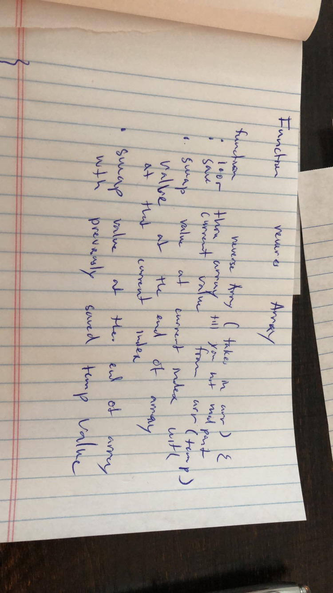

# Reverse an Array
Given an array as input to a function, the function should return the array in reverse format

## Challenge
Write a function called reverseArray which takes an array as an argument. Without utilizing any of the built-in methods available to your language, return an array with elements in reversed order.

## Approach & Efficiency
<!-- What approach did you take? Why? What is the Big O space/time for this approach? -->
I took the approach of swapping instead of pushing to the new array. I wanted to solve this challenge without creating a new data structure. This is O(n) for time and O(1) for space.

## Solution
<!-- Embedded whiteboard image -->
